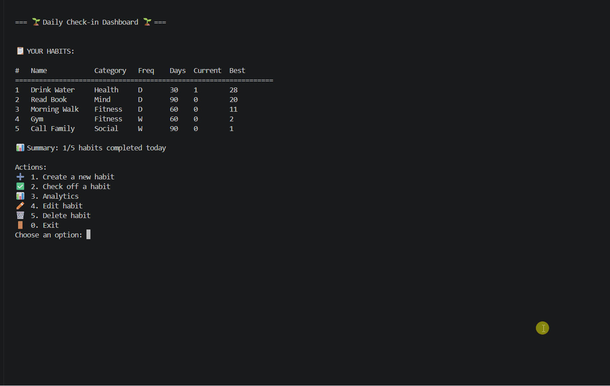
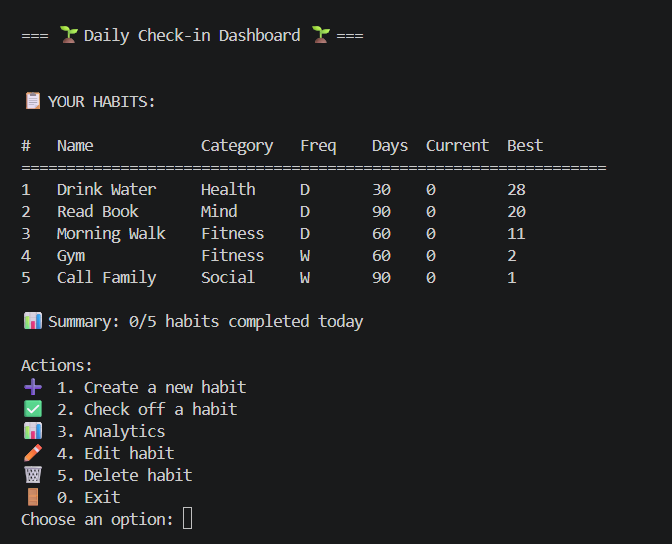
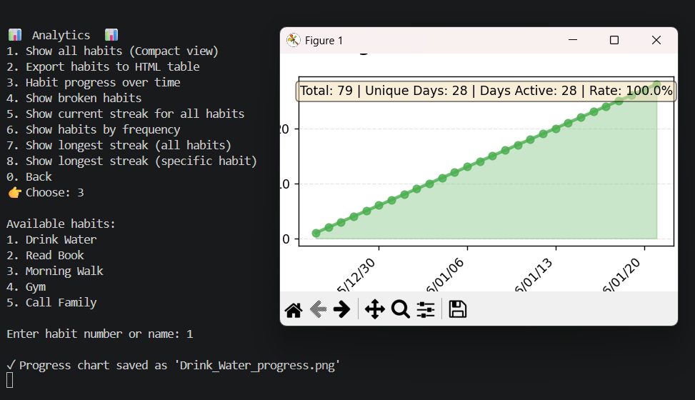
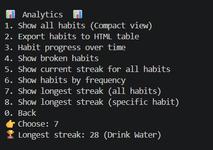

# Habit-tracking-application 

A command-line habit tracking application built with Python.
It helps users build consistency by tracking habits, managing streaks,
and analyzing long-term behavior using clean, testable logic.

The application focuses on core habit tracking functionality and does not include any
graphical user interface.

---
## 🎬 Demo


## 📸 Screenshots

 

## Features

- Create and manage multiple habits
- Support for daily and weekly habit periodicity
- Check off habits at any point in time
- Automatic detection of broken habits
- Streak tracking based on consecutive completed periods
- Functional analytics module providing:
  - A list of all tracked habits
  - A list of habits by periodicity
  - The longest streak across all habits
  - The longest streak for a specific habit
- Persistent storage using SQLite
- Command Line Interface (CLI) for user interaction

---


## Requirements

- Before to start make sure that you have Python 3.9+ on your device 

or you can download it: https://www.python.org/downloads/

- Git (optional, for version control)

- Visual Studio Code (recommended)

-- Third-party Libraries (need pip install)

matplotlib → for plotting habit progress (plot_habit_progress)

pytest → for testing your modules (test_habit.py, test_storage.py,test_analytics.py )
- To install all dependencies at once:

       run python -m pip install -r requirements.txt

- How to Run the Application

- From the project root directory, run:

  python main.py


##  Setup

  ```md

  > Run all commands below in your terminal (Command Prompt PowerShell, or VS Code terminal).

  > Note: This repository contains multiple projects. Only the `habit-tracker` folder is required for this application. 

 1. Clone the repository:
   ```bash
   git clone https://github.com/Ezzouzi-Fatima-Ezzahrae/IU_Projects.git
   ...

 2. Navigate to the Habit Tracker project:

   cd IU_Projects/DLBDSOOFPP01/habit_tracker_phase3/habit-tracker

 3. Create a virtual environment:

   python -m venv venv

 4. Activate the virtual environment:

  Windows:

  venv\Scripts\activate

  macOS / Linux:

  source venv/bin/activate
 5. Install dependencies:

   pip install -r requirements.txt

 6. Run the application:

   python main.py  
...
---

## Default Data

On first startup, the application automatically loads 5 predefined habits:

- At least one daily habit  
- At least one weekly habit  

Each habit includes sample tracking data for 4 weeks, including:
- Missed days  
- Broken streaks  

This dataset is used to test and validate the analytics features.
  

## Habit Streak Logic

A habit must be completed at least once during its defined period:

- Daily habits must be completed once per day

- Weekly habits must be completed once every 7 days

If a habit is not completed within its period, the habit is considered broken
and the current streak resets to zero. A streak represents the number of
consecutive completed periods without breaking the habit.


# Contributing

Your feedback, ideas, and contributions are welcomed!

## License

This project is licensed under the MIT License.

## Author

Fatima Ezzahrae Ezzouzi
